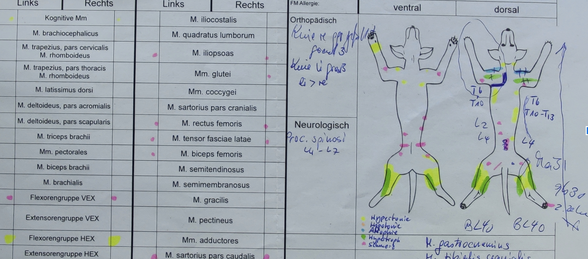

# Findus - PSE WiSe21-22

- Dieses Projekt ist Teil eines gemeinsamen Forschungsprojekts (Antrag läuft) und unterliegt somit
  der **Vertraulichkeit**.
- Alle in diesem Projekt erstellten Artefakte stehen den beteiligten Projektpartnern vollumfänglich
  zur Verfügung, d.h. alle Mitwirkenden geben ihre Urheberrechte und Verwertungsbefugnisse
  vollumfänglich an die Antragsteller des Forschungsprojekts ab.
- Das Projekt wird von Ute Trapp (Product Owner), Colja Wesp und Clarissa Goedecke (Feedback,
  Bewertungsvorschläge, technischer Support, UX-Support ...) betreut.

Projektinterne Kommunikation: https://discord.gg/dKA3AANN

## Termine

- Termine mit allen: ab 20.10., jeweils 10:15 - 11:45, 12:30 - 14:00 Uhr, in einem virtuellen
  BBB-Raum, Weihnachtspause 17.12.-10.1, **Abschlusstermin: 16.2.22**
- Kick-Off am 20.10. vorzugsweise vor Ort am Fachbereich
- jedes Teilteam vereinbart einen Zusatztermin für ein "Daily", vorzugsweise Fr oder Mo.

## Kriterien zur Bewertung - was sollte jede:r lernen?

- Umgang mit gitlab (Issue-Board, gute Commitkommentare, Datei-Struktur, Merge, Pipeline)
- Projektplanung und Mitarbeit im Projekt
  - rechtzeitige und klare Kommunikation bei Problemen
  - Qualitätsbewusstsein (Code-Inspection, automatische Tests mit Mocking, Code Review, Verwendung
    von Design Patterns)
  - produktive Mitarbeit
- Storypoints anteilig erfolgreich bearbeiten
- Ideen entwickeln und das Projekt aktiv voran treiben
- selbständige Einarbeitung in neue Programmiersprachen und Technologien
- Präsentation eines Teilthemas

## Vision

Mit **Findus** können in Veterinärmedizinpraxen und Veterinärphysiotherapiepraxen

- einfach Befunde tabellarisch und visuell dokumentiert werden
  vgl. 
  oder https://synaptos.at/bodychart/ https://www.medocheck.com/physiotherapeuten
- der Behandlungsverlauf leicht verfolgt und
- auf Basis von numerischen Modellen und KI-basierten Computer-Vision-Modellen Differentialdiagnosen
  vorgeschlagen werden. Derzeit sind die Untersuchungs- und vor allem die Dokumentationstechniken
  sehr aufwendig und zeitraubend. Oft fehlt es an Zeit, eine detaillierte schriftliche Dokumentation
  zu erstellen, welche sowohl qualitative als auch quantitative individuelle Eigenheiten des
  untersuchten Tieres festhält. Dennoch sind Tierärzt:innen rechtlich dazu verpflichtet. Auch ist es
  praktisch unmöglich, vor jeder Therapie den gesamten Bericht der letzten Untersuchungen und
  Therapien im Detail durchzulesen und schnell zu überblicken. Im BPSE wird der Technologiestack
  aufgebaut, um die Befundung tabellarisch und visuell zu dokumentieren, einen Verlauf darzustellen
  und anonymisierte Daten zur weiteren Analyse zur Verfügung zu stellen. Im Projekt wird möglichst
  viel in Kotlin implementiert. Folgende Architektur ist geplant: Auf einem Tablet (iOS oder
  Android) und auf einer Desktop-Anwendung (Windows oder Mac) läuft eine
  auf https://kotlinlang.org/docs/multiplatform.html basierende GUI (Client) zum Erfassen der
  Befunde und zur Darstellung des Verlaufs. Serverseitig (Windows/iOS/Linux)
  wird [KTOR](https://ktor.io/) verwendet. Client und Server kommunizieren über REST. Die REST-API
  wird mit [OpenAPI](https://oai.github.io/Documentation/start-here.html) dokumentiert,
  vgl. https://code.fbi.h-da.de/pse-trapp-public/intentfinder/-/issues/64
  Die Daten werden mit [KMongo](https://litote.org/kmongo/) in einer MongoDB gespeichert, d.h. alle
  Daten, die für den Client benötigt werden befinden sich hier. Zur KI-basierten Analyse (diese ist
  nicht Teil des Projekts) werden die Daten aller Clients, d.h. aller Praxen anonymisiert in einer
  weiteren vorzugsweise cloud-basierten DB gespeichert (AWS oder Azure -- sofern hier Vorkenntnisse
  im Team existieren, alternativ eine weiter KTOR-KMongo-Instanz). Als IDE verwenden wir IDEA von
  IntelliJ und die Anwendung läuft in entsprechenden Docker-Containern.

## Teams

Im Projekt werden ca. 16 Studierenden - davon ca. 6 Studierende aus dem dritten Semester KMI -
zusammen arbeiten. Dies sind zu viele für ein Scrum-Team, daher werden wir zwei voll-funktionale
Teilteams von jeweils 8 Studierenden bilden. Alle Teams arbeiten nach Scrum, führen also Retros,
Planning und Reviews durch und führen ihr jeweiliges Board in gitlab. Zweimal in der Woche gibt es
das Daily. Dazu arbeiten wir nach Scrum of Scrum. Für das zweite "Daily" müssen Sie für Ihr Teilteam
einen Zusatztermin vereinbaren. Jedes Team hat eine:n Scrum Master (ca. 40% der Arbeitszeit),
der/die die Meetings plant, vorbereitet und moderiert und alles daran setzt, dass das Team gut
arbeiten kann, er/sie kommuniziert frühst möglich eventuelle Probleme an die Projektbetreuer:innen.
Zusätzlich hat jedes Team einen *git-Head* der/die die Pipeline einrichtet, über die Kommentare und
Struktur des Repos wacht, Merge-Request bearbeitet. Die Rollen können nach einem Sprint gewechselt
werden. Sowohl Scrum-Master als auch git-Head sind sehr wichtige Rollen im Team und sollten von
möglichst dev-erfahrenen Studierenden, die dazu kommunikativ stark sind, besetzt werden. Alle im
Team arbeiten ihre geschätzten Stories anteilig ab. Für alle Teams gelten folgende Anforderungen:

- Es wird möglichst nach TDD gearbeitet und jederzeit wird eine volle Testabdeckung von
  kritischem/logischen Code gesichert.
- Programmcode/Kommentare etc. in Englisch,
  vgl.  https://kotlinlang.org/docs/coding-conventions.html
- alle erarbeiten sich grundlegende Kenntnisse von
  - Scrum (Grundlagen von SWE: Retro, Review, Planning)
  - gitlab (Grundlagen von SWE: merge, commit, pull, push, Kommentare, Issues, Board)
  - ktor und Kotlin
    - https://kotlinlang.org/docs/idioms.html
    - https://play.kotlinlang.org/hands-on/Creating HTTP APIs with Ktor/
    - Projektbeispiel: https://github.com/joreilly/PeopleInSpace
  - REST-Apis (Grundlagen aus verteilte Systeme: was ist REST, wie sieht eine gute API aus?, Testen
    mit Postman)
  - automatischen Tests (Grundlagen von SWE: testbarer Code, gute Unit-Tests)
  - alle erarbeiten sich vertiefte Kenntnisse gemäß ihren Rollen im Team und gemäß der Anforderungen
    des Teams.
  - Alle führen ein Code-Review mit jemandem aus dem Team durch, bevor der Code im Master-Branch
    gemerged wird, Stichwort Merge-Request, vgl. Definition of Done. Zuvor führt jede:r eine
    Code-Inspection durch.
  - Alle reflektieren 14tägig oder wöchentlich für sich ihre Arbeit, ihren Anteil am Projekt in
    einer md-Datei in gitlab.

Wir erwarten ein strukturiertes zielorientiertes Vorgehen, dass Sie entsprechend dokumentieren. Wir
erwarten eine kreative und bestmögliche Umsetzung und eine gute und ehrliche Dokumentation, was das
System wirklich kann und was noch zu tun ist :)

Im Projekt sind ca. 10 Studierende aus dem höheren Semester und ca. 6 Studierende aus dem dritten
Semester KMI. Die KMI-ler haben den Fokus auf UX und erstellen zur Dokumentation des Projekts ein
Video, das auf Youtube publiziert wird -- sie können natürlich gemäß ihren Interessen auch mit
entwickeln. Zusätzlich gibt es in der Mathematik ein parallel laufendes Master-Projekt, die die
anonymisierten Befunddaten numerisch analysieren. Mit dieser Projektgruppe wird es 2-3 gemeinsame
Meetings im Semester geben.

### Definition of Done

1. Akzeptanzkriterien erfüllt
2. Code läuft fehlerfrei
3. Tests implementiert
4. Code-Inspection zeigt keine relevanten Warnings
5. Code-Review durchgeführt (vgl. 6., unten bei gitlab - Workflow)
6. Vor dem Merge-Request den master-Branch gemerged
6. Merge Request gestellt & angenommen vom Git-Head, Kommentare umgesetzt
7. CI läuft ohne Warnings durch
8. ReadMe ergänzt

### Code Review

Ziele eines Codereviews

- Code verbessern
- voneinander lernen
- best practices umsetzen
- Fehler vermeiden
- Konsistenz im gesamten Projekt
- Merge Requests möglichst ohne Probleme durchführen -- wer den MR durchführt, hofft auf ein zuvor
  gut durchgeführtes Code Review, schaut sich den Code aber nochmal an, d.h. wird nicht einfach
  darauf vertrauen, dass im Code Review schon alles aufgeräumt/verbessert wurde ...

### gitlab

- Board aktuell halten
- In das Verzeichnis mit dem eigentlichen Programmcode nur mit PRs pushen, einfache Doc-Änderungen,
  die Präsentationen, Zeitpläne etc. können direkt auf dem Master gepushed werden (bitte auch hier
  die Commit-Kommentare beachten)
- Workflow
  1. Issue nehmen und nach *doing* verschieben
  2. Branch erstellen
  3. Feature mit Tests implementieren und dabei nach jeder Implementationseinheit pushen
  4. Code aufräumen, Code inspection etc.
  5. Master in die eigene Branch mergen
	    - Hierfür einfach `git merge master` auf dem entsprechenden Branch ausführen
      - andernfalls wie beschrieben auch in der GitLab Webanwendung möglich
  6. Issue nach *needs review* schieben
  7. Code-Review mit einer anderen Person durchführen -- dies ist eher ein Pair-Programming und eine
     Vorstufe zum Merge-Request
  8. Merge-Request stellen (Template benutzen und *Draft:* in den Titel schreiben)
  9. Branch wird vom Git-Head nochmal überprüft und sobald alles in Ordnung ist gemerged
      - Falls etwas auffällt, wird dies am Code oder in einem Kommentar in der Merge Request vermekt
  10. Nach erfolgreichem Merge-Request Issue nach *Sprint Review* schieben -- nur die dort
     aufgelisteten Issues werden im Sprint Review gezeigt
- Naming
  - Datei- und Verzeichnisnamen in Englisch und nur die Zeichen [a-zAZ0-9_-]
  - Commit-Kommentar -- vgl. https://chris.beams.io/posts/git-commit/
    - Struktur [feat/fix/docs/style/refactor/learn/orga/test]{ #issue}: Summary
    - Beispiele
    - feat #7: Add search endpoint to server
    - docs: Fix naming in main readme
  - Branches
    - Struktur: feat/fix/docs/style/refactor/learn/orga/test / #issue Titel
    - Beispiel *feat/49-adds_new_endpoints_to_fastAPI*
  - Merge-Request
    - Struktur #Issue Titel
    - Beispiel *#49 adds new endpoints to FastAPI*
    - hilfreiche Links
      - https://docs.gitlab.com/ee/development/code_review.html
      - https://www.gitkraken.com/blog/code-review
      - https://blog.codacy.com/how-to-code-review-in-a-pull-request/
      - https://www.pullrequest.com/blog/11-ways-to-create-pull-requests-that-are-easy-to-review/
- Sprache
  - gitlab-Kommentare, Programmcode komplett in Englisch
  - Issues, Kommentare dort in Deutsch oder Englisch

### Zeitplan/Meilensteine

Sprintlänge: 3w

- 20.10.: Kick-Off, kennenlernen, Teambuilding (Vorbereitung und Moderation: Trapp/Wesp/Goedecke),
  alle Teammitglieder arbeiten sich in Kotlin, REST, gitlab und ein individuelles Thema s.u. ein.
- 27.10.: Input zu den Einarbeitungsthemen von Ihnen (Moderation: Trapp/Wesp/Goedecke), Bilden von
  zwei Scrum-Teams
  - Einarbeitungsthemen:
    - Docker-Container selbst erstellen (am Beispiel von KTor, OpenAPI, Mongo-DB),
      vgl. https://code.fbi.h-da.de/pse-trapp-public/intentfinder/-/tree/master/src/docker-openapi-validator
      und Ihr Wissen aus Verteilte Systeme
    - gute REST-API, vgl. https://github.com/microsoft/api-guidelines/blob/vNext/Guidelines.md inkl.
      gute Beispiele im Kontexts des Projekts, Recherche anderer APIs, die öffentlich zugänglich
      sind und zum Thema passen, gerne schon Beispiel in Ktor
    - OpenAPI am Beispiel von KTor, vgl. https://github.com/papsign/Ktor-OpenAPI-Generator bzw.
      mittlerweile von KTor direkt verlinkt: https://ktor.io/docs/openapi-swagger.html
    - MongoDB, insb. was macht eine gute Struktur in MongoDB aus, inkl. lesender und schreibender
      Zugriff mit KMongo
    - Mocking mit Mockito und gute Unit-Tests in Kotlin inkl. guten Beispiele (bitte nicht wieder
      Taschenrechner ...), Schwerpunkt ist Mockito nicht Unit-Tests allgemein
    - Projektstruktur von multiplatform und nativen Kotlin-Anwendungen, hier ein gute Templates
      recherchieren und dies wird unsere Basis, also bitte sorgfältig recherchieren und gut testen
    - gitlab inkl. CI bei push
    - API-Tests mit Postman, inkl. Authentifizierung
- 3.11.: Sprint-Planning (bis hierhin müssen Sie sich in Kotlin, multiplatform etc. eingearbeitet
  haben), ab hier planen und moderieren die Scrum-Master
- 10.11.: Pair-Programming und verbleibende Präsentationen der Einarbeitungsthemen
- Sprint-Review, Retrospektive und Vorstellung der Issues, Sprint-Planning erfolgt in einem
  separaten Termin bis spätestens Freitag
- 24.11. Sprint-Review, Rertrospektive, Sprintplanning für Sprint 2
- 15.12. Sprint-Review, Rertrospektive
- 15.12. - 12.01.: Backlog leeren und in neue Issues einarbeiten
- 12.01.: Sprint Planning für Sprint 3, Pair Programming
- 02.02.: Sprint-Review Sprint 3
- 9.2.22: Projektabschluss unter Beteiligung der Projektpartner Weitere Termine gemäß OBS, OBS hat
  immer Recht ;-)

## Epics

Alle Stories werden zunächst für die Hunderasse Golden Retriever implementiert. Die
Multiplatformfähigkeit wird an zwei Beispielen gezeigt, z.B. Web und Android (die konkreten
Platformen werden noch diskutiert und richtet sich auch nach den Interessen des Teams), d.h. es
werden mindestens zwei GUIs implementiert.

- Erstellung der Docker-Container
- Definition der MongoDB-Struktur mit Beispieldaten
- Erstellung verschiedener Design-Varianten (Paper- und Klick-Prototypen)
- Interviews und Evaluierung der Prototypen mit Veterinärmedizinpraxen
- Erfassung tabellarischer Daten und Freitext
- Erfassung und Editieren von verschiedenen getasteten Befunden in einer schematischen Skizze
- Darstellung des Behandlungsverlaufs der tabellarischen Daten
- Darstellung des Behandlungsverlaufs der schematischen Darstellung
- Speicherung der anonymisierten Daten in einem Cloud-Speicher
- Darstellung von Differentialdiagnosevorschlägen mit gemockten KI-Diensten
- Daten zwischen verschiedenen Praxen können nach Freigabe durch die Patient:innen untereinander
  ausgetauscht werden 
