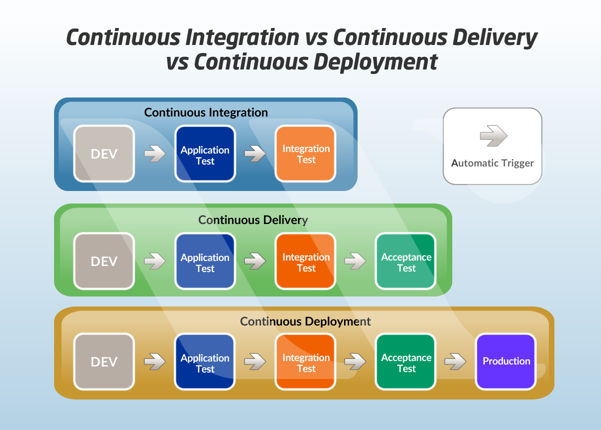

### Git Workflow
- Workflow
    1. Issue nehmen und nach *doing* verschieben
    2. Branch erstellen
    3. Feature mit Tests implementieren und dabei nach jeder Implementationseinheit pushen
    4. Code aufräumen, Code inspection etc.
    5. Master-Branch mergen
    6. Code-Review mit einer anderen Person durchführen -- dies ist eher ein Pair-Programming und eine Vorstufe zum Merge-Request
    7. Merge-Request stellen und Issue nach *needs review* schieben
    8. Nach erfolgreichem Merge-Request Issue nach *Sprint Review* schieben -- nur die dort aufgelisteten Issues werden im Sprint Review gezeigt
- Naming
    - Datei- und Verzeichnisnamen in Englisch und nur die Zeichen [a-zAZ0-9_-]
    - Commit-Kommentar -- vgl. https://chris.beams.io/posts/git-commit/
        - Struktur [feat/fix/docs/style/refactor/learn/orga/test]{-#issue}: Summary
        - Beispiele
        - feat-#7: Add search endpoint to server
        - docs: Fix naming in main readme
    - Branches
        - Struktur: feat/fix/docs/style/refactor/learn/orga/test / #issue Titel
        - Beispiel *feat/49-adds_new_endpoints_to_fastAPI*
    - Merge-Request
        - Struktur #Issue Titel
        - Beispiel *#49 adds new endpoints to FastAPI*
- hilfreiche Links zum Arbeiten mit gitlab
    - https://docs.gitlab.com/ee/development/code_review.html
- Sprache
    - gitlab-Kommentare, Programmcode komplett in Englisch
    - Issues, Kommentare dort in Deutsch oder Englisch

### Was ist CI/CD?
In der modernen Software-Entwicklung wird dieser Schritt, bei jeder Änderung des Source Codes durchgeführt. Dies nennt man Continuous Integration. Dabei wird der geänderte Source Code mit dem restlichen Source Code zusammengeführt, gebaut und getestet. Der Entwickler erhält sofort Feedback, ob alles mit seiner Änderung in Ordnung ist. Durch die Continuous Integration werden Änderungen sofort zusammengeführt und getestet. Die Änderungen sind kleiner und dadurch wird das Risiko verringert, dass die Änderung ein Problem verursacht. Sollte die Änderung dennoch ein Problem verursachen, wird dieses sofort erkannt, zugeordnet und kann behoben werden. Continuous Integration ist die Grundlage für Continuous Delivery oder Continuous Deployment.

### Gitlab CI Datei
In der Gitlab CI Datei wird die CI Pipeline definiert. Die Datei muss im Root Verzeichnis des Projekts liegen und muss eine korrekte YAML syntax haben.

### YAML
Die grundsätzliche Annahme von YAML ist, dass sich jede beliebige Datenstruktur nur mit assoziativen Listen, Listen (Arrays) und Einzelwerten (Skalaren) darstellen lässt. Durch dieses einfache Konzept ist YAML wesentlich leichter von Menschen zu lesen und zu schreiben als beispielsweise XML, außerdem vereinfacht es die Weiterverarbeitung der Daten, da die meisten Sprachen solche Konstrukte bereits integriert haben.

### Hinweis
Um in der Beispiel Pipeline den `code_style` stritt ausführen zu können muss vorher ein Kotlin-Linter dem Projekt hinzugefügt werden. Am einfachsten ist das mittels Gradle möglich, dazu muss man nur in den Dependencies die gewünschte Library hinzufügen zum Beispiel: `id("org.jlleitschuh.gradle.ktlint") version "10.2.0"`.

### Nützliche Links
https://docs.gitlab.com/ee/ci/

https://docs.gitlab.com/ee/ci/runners/configure_runners.html

https://gitlab.com/org.hsmith.medium/kotlin-build-pipeline/-/tree/master
